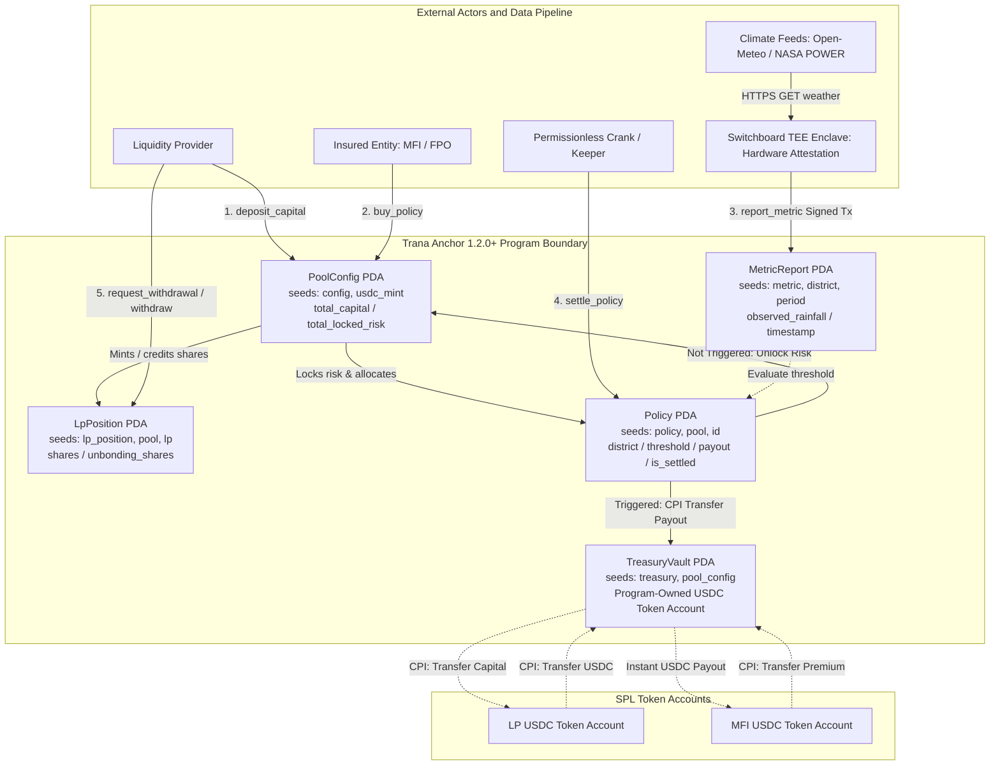
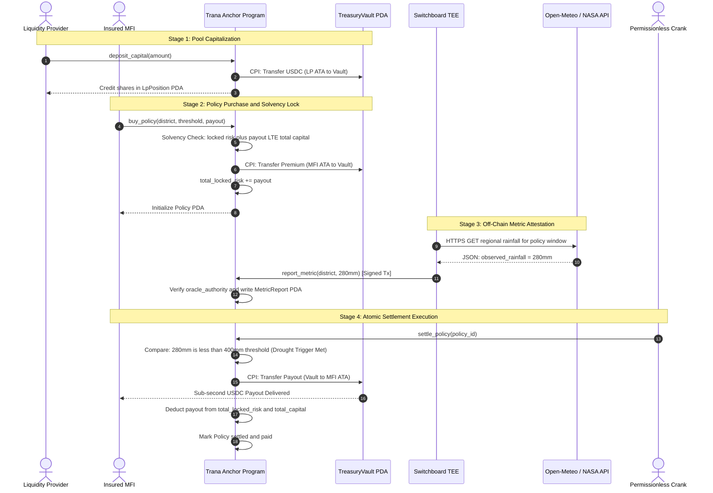

# Turbin3 Capstone Deliverable 1: Letter of Intent (LOI) & On-Chain Use Cases
## Project: Trana Protocol (Parametric Climate Reinsurance on Solana)

**Author:** 0xgsvs (Venkat Subrahmanyam) — Turbin3 Q3 2026 Solana Builder  
**Category:** Real World Assets (RWAs) / Structured Credit & Parametric Risk Underwriting  
**Framework:** [Solana Anchor 1.2.0+](https://www.anchor-lang.com/)  

---

# Part 1: Final Project Proposal & LOI

## 1. High-Level Concept Overview (2–5 Sentences)
**Trana Protocol** (Sanskrit: त्राण (*trāṇa*) — protection, shelter from catastrophe, indemnity) is a decentralized parametric reinsurance and balance-sheet hedging protocol built on Solana using Anchor 1.2.0+. It enables rural lenders (Microfinance Institutions and Farmer Producer Organizations) to purchase programmatic climate hedges that trigger instant, automated liquidity payouts in USDC when verified regional rainfall drops below actuarial drought thresholds. Global liquidity providers underwrite localized weather volatility in exchange for uncorrelated real-yield premiums, with solvency mathematically guaranteed on-chain through fully collateralized vaults. By replacing multi-month subjective loss adjusters with atomic smart-contract execution, Trana protects rural credit supply against climate-driven insolvency.

---

## 2. Core Value Proposition & Product-Market Fit (PMF)

### 2.1 Synthesized Value Proposition
Emerging market rural lenders are structurally vulnerable to monsoon failure: a regional drought spikes microfinance non-performing assets (NPAs) from sub-2% to over 30–40% (*RBI Financial Stability Report*), threatening institutional solvency and freezing agricultural credit lines. Traditional government crop insurance (Pradhan Mantri Fasal Bima Yojana / PMFBY) fails lenders because contested manual Crop Cutting Experiments (CCEs) delay claim disbursements by 6 to 18 months, while retail B2C crypto insurance fails due to lack of farmer crypto literacy, cash-basis economies, and strict domestic insurance licensing regulations. Trana operates strictly B2B at the institutional balance-sheet level: rural lenders deposit USDC premiums into a fully collateralized on-chain vault, while verified oracle feeds ([Open-Meteo](https://open-meteo.com/) and [NASA POWER](https://power.larc.nasa.gov/)) trigger sub-second USDC liquidity injections upon threshold breach. This eliminates claims fraud, cuts administrative loss-adjustment costs to zero, protects primary lender solvency, and delivers global crypto capital an uncorrelated 12–16% APY backed by physical climate probability models ([Arbol](https://www.arbol.io/)).

### 2.2 Coverage Check & Missing Value Drivers Addressed
- **Basis Risk Mitigation:** Uses high-resolution [NASA POWER Agroclimatology](https://power.larc.nasa.gov/) gridded satellite feeds and regional station data to match local microclimates rather than statewide averages.
- **Regulatory Ringfencing:** Structured as an offshore parametric catastrophe derivative ([Nexus Mutual Mutual Model](https://docs.nexusmutual.io/)) between international liquidity pools and domestic institutional entities, bypassing retail insurance broker licensing constraints.
- **Capital Solvency Invariant:** 100% full collateralization enforced in Anchor (`total_locked_risk <= total_capital`), eliminating fractional-reserve default risk.
- **Fiat Boundary Isolation:** Primary lenders manage domestic fiat-to-USDC conversions via corporate channels, insulating retail borrowers from crypto mechanics while shielding on-chain pools from fiat regulatory touchpoints.

---

## 3. Target Markets & User Profiles

### 3.1 Target Market Segments
1. **Tier-2 / Tier-3 Microfinance Institutions (MFIs):** Over ₹4.2 Lakh Crore ($50B) gross loan portfolio in India ([MFIN Micrometer Industry Data](https://mfinindia.org/)) with 65%+ rural exposure vulnerable to regional drought default contagion.
2. **Farmer Producer Organizations (FPOs):** Over 10,000 registered agri-cooperatives managing collective procurement, member inputs, and harvest default risks.
3. **Institutional DeFi Liquidity Providers:** Stablecoin capital seeking sustainable real yields uncorrelated with Bitcoin/Ethereum market cycles or token emissions.

### 3.2 Detailed User Profiles
- **Profile 1 (Buyer): Ramesh Sharma, CRO of a Tier-2 MFI in Maharashtra.**
  - *Problem:* Manages a ₹300 Cr rural portfolio. Severe monsoon deficit causes mass defaults across 40,000 cotton borrowers, breaching commercial bank debt covenants.
  - *Workflow:* Buys a 4-month Kharif season drought hedge on Trana for 5 target districts. Deposits 100,000 USDC premium to secure a 1,000,000 USDC emergency liquidity line.
  - *Outcome:* Programmatic payout executes on seasonal maturity if rainfall is below 400mm, absorbing credit losses immediately without waiting for government subsidies.
- **Profile 2 (Underwriter): Arthur Vance, Portfolio Manager at a Digital Credit Fund.**
  - *Problem:* Low 4–6% yields on standard lending protocols; high vulnerability to crypto-wide market downturns.
  - *Workflow:* Allocates 1,000,000 USDC into Trana’s Senior Underwriting Vault with a 14-day unbonding lockup.
  - *Outcome:* Earns 100% of upfront policy premiums minus protocol fees, targeting a 12–16% net seasonal IRR based on backtested precipitation distributions.

---

## 4. Competitor Landscape

| Competitor | Platform | Model | Strengths | Critical Vulnerabilities / Gaps |
|---|---|---|---|---|
| **[Arbol](https://www.arbol.io/)** | Avalanche / Base | Institutional parametric climate MGA | $1B+ in transacted volume; deep institutional reinsurance relationships | Closed-source underwriting, opaque private pricing, high minimum policy sizes ($250k+) |
| **[Etherisc](https://github.com/etherisc)** | Ethereum / Gnosis | Decentralized insurance protocol | Early crypto pioneer; deployed smallholder pilots with ACRE Africa | High Ethereum L1 gas fees, low liquidity (<$5M TVL), slow settlement |
| **[Nexus Mutual](https://docs.nexusmutual.io/)** | Ethereum | Discretionary risk-sharing mutual | $200M+ capital pool; proven legal and governance structure | Exclusively crypto-native risks; subjective manual voting; zero physical weather oracles |
| **[Credix](https://docs.credix.finance/)** | Solana | Emerging market private credit marketplace | Institutional USDC liquidity rails on Solana ($50M+ originated in LatAm) | Underwrites credit facilities, not climate tail-risk; drought causes borrower defaults |
| **Trana Protocol** | Solana (Anchor 1.2.0+) | Autonomous parametric balance-sheet reinsurance | Sub-second settlement, sub-cent fees, strict solvency invariant, open Anchor state machine | Early-stage oracle crank dependency; requires specialized local distribution channel partners |

**PMF Differentiation:** Rather than competing with credit protocols like Credix, Trana acts as the *protective insurance layer* that credit originators mandate their borrowers carry to de-risk balance sheets.

---

## 5. Founder-Market Fit (FMF)
- **Technical Capabilities:** 0xgsvs is a Turbin3 Q3 2026 Solana builder with demonstrated Anchor 1.2.0+, LiteSVM, custom PDA, and timed vault implementations.
- **Domain Context:** Located in India (+05:30), with direct native understanding of rural banking structures, Priority Sector Lending (PSL) guidelines ([RBI Master Direction FIDD.CO.Plan.BC.5/04.09.01/2020-21](https://www.rbi.org.in/Scripts/NotificationUser.aspx?Id=11959&Mode=0)), and the administrative failure modes of manual crop-cutting assessments.
- **Data Pipeline:** Working knowledge of [Open-Meteo](https://open-meteo.com/) and [NASA POWER](https://power.larc.nasa.gov/) weather APIs, as well as [Switchboard TEE Functions](https://docs.switchboard.xyz/) on Solana.

---

## 6. Actors & Protocol Roles
- **Direct Actors (Signers):** Insured MFI/FPO (`buy_policy`), Liquidity Provider (`deposit_capital`, `withdraw_capital`), Oracle Crank (`report_metric`).
- **Beneficiaries:** Smallholder farmers (maintain continued borrowing access because primary lender remains solvent).
- **Administrators:** Protocol Governance Multisig (`initialize_pool`, update oracle authorities, set fee bps).
- **Stakeholders:** Solana DeFi ecosystem (access to high-capacity, non-cyclical real-world yield).

---

## 7. Anchor 1.2.0+ Architecture & Workflow Diagrams

### 7.1 Program Account Architecture

### 7.2 End-to-End Workflow Sequence

### 7.3 Anchor 1.2.0+ Use Cases (One Case = One Instruction Handler)

1. **`initialize_pool`**: Admin initializes `PoolConfig` PDA and program-owned `TreasuryVault` token account. Sets protocol fee bps.
2. **`deposit_capital`**: LP transfers USDC into `TreasuryVault` via SPL Token CPI. Program mints pool shares into `LpPosition` PDA and increments `total_capital`.
3. **`buy_policy`**: Insured transfers USDC premium to `TreasuryVault`. Program verifies solvency (`total_capital - total_locked_risk >= payout_amount`), locks payout risk (`total_locked_risk += payout_amount`), and creates `Policy` PDA.
4. **`report_metric`**: Verified oracle crank ([Switchboard TEE](https://docs.switchboard.xyz/)) writes attested rainfall data into `MetricReport` PDA.
5. **`settle_policy`**: Permissionless instruction callable after policy expiry. Compares `MetricReport.observed` against `Policy.threshold`:
   - *Triggered:* CPI transfers `payout_amount` from `TreasuryVault` to insured; decrements `total_locked_risk` and `total_capital`.
   - *Not Triggered:* Unlocks `payout_amount` from `total_locked_risk` back into unallocated pool capital.
6. **`request_withdrawal`**: LP initiates unbonding cooldown (14 days) in `LpPosition` PDA to block withdrawal frontrunning during drought warnings.
7. **`withdraw_capital`**: LP redeems matured unbonded shares for USDC from unencumbered capital.

---

## 8. On-Chain Reference Matrix

| Account Struct | PDA Seeds | Owner | Key Fields |
|---|---|---|---|
| `PoolConfig` | `[b"config", usdc_mint]` | Trana Program | `admin`, `oracle_authority`, `total_capital`, `total_locked_risk`, `fee_bps` |
| `TreasuryVault` | `[b"treasury", pool_config]` | SPL Token Program | USDC token account owned by `PoolConfig` PDA |
| `Policy` | `[b"policy", pool_config, policy_id]` | Trana Program | `insured`, `target_id`, `threshold`, `payout_amount`, `is_settled`, `is_paid` |
| `LpPosition` | `[b"lp_position", pool_config, lp]` | Trana Program | `lp`, `shares`, `unbonding_shares`, `unbonding_timestamp` |
| `MetricReport` | `[b"metric", target_id, period_id]` | Trana Program | `target_id`, `period_id`, `observed_value`, `timestamp`, `reporter` |

---
---

# Part 2: Process Appendix (Red Team Log)

### 1. Initial Draft vs. Red Team Attack & Resolution

| Topic | Raw Initial Assumption | AI Red Team Attack Point | Accepted / Rejected & Strategic Fix |
|---|---|---|---|
| **User Target** | Retail smallholder Indian farmers buying $10 policies via Phantom wallet. | **Fatal Flaw:** Farmers operate in cash, lack crypto wallets, and insurance regulations prohibit retail crypto policies. | **ACCEPTED:** Shifted 100% to institutional B2B reinsurance for MFIs/FPOs. Farmers receive standard INR credit; crypto stays on backend. |
| **Solvency Model** | Fractional pool estimating 20% max payout per season. | **Insolvency Risk:** Multi-district drought causes 100% loss correlation, wiping out an unreserved pool. | **ACCEPTED:** Enforced strict invariant: `total_locked_risk + payout_amount <= total_capital`. 100% full collateralization. |
| **Oracle Feed** | Assumed Pyth or Chainlink have rural Indian rainfall feeds on Solana. | **Data Missing:** Pyth exclusively provides high-frequency financial/crypto price feeds; no regional weather feeds. | **ACCEPTED:** Production architecture uses [Switchboard TEE Functions](https://docs.switchboard.xyz/) to scrape [Open-Meteo](https://open-meteo.com/) and [NASA POWER](https://power.larc.nasa.gov/). Devnet uses dedicated authority crank. |
| **LP Yields** | Assumed LPs would accept 5% APY for locking capital. | **Unattractive Yield:** US Treasuries yield ~5% risk-free; LPs will not take catastrophe risk for 5%. | **REJECTED / ADJUSTED:** Parametric catastrophe risk is priced at 12–16% APY and is 100% uncorrelated with crypto or Fed cycles. Added 14-day unbonding cooldown to protect LPs. |

---

## 2. Verification Sign-Off Sources
- **Banking Mandates & Credit Regulations:** [Reserve Bank of India Master Directions FIDD.CO.Plan.BC.5/04.09.01/2020-21 (Priority Sector Lending Targets and Classification)](https://www.rbi.org.in/Scripts/NotificationUser.aspx?Id=11959&Mode=0).
- **Microfinance Industry Scale:** [MFIN India (Microfinance Institutions Network) Industry Reports](https://mfinindia.org/).
- **Climate Data Feeds:** [Open-Meteo Global Weather API](https://open-meteo.com/) and [NASA POWER Agroclimatology Data](https://power.larc.nasa.gov/).
- **On-Chain Framework & Oracles:** [Anchor Framework Documentation](https://www.anchor-lang.com/) and [Switchboard Oracle Documentation](https://docs.switchboard.xyz/).
