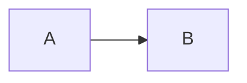

# Trana Protocol — Documentation

VitePress site documenting the Anchor program in `../trana/programs/trana`.

Everything here describes the program as implemented in `src/`, not as described
in `../LOI_DELIVERABLE_TRANA.md`. Where those disagree, the divergences are
listed explicitly under `appendix/`.

## Requirements

- [mise](https://mise.jdx.dev/) for the pinned toolchains, or Node 22+ / bun 1.4+

## Commands

```bash
bun install         # install dependencies
bun run dev         # dev server with HMR at http://localhost:5173
bun run build       # production build -> .vitepress/dist
bun run preview     # serve the built output
bun run test        # vitest: sidebar integrity, diagram validity, source drift
bun run test:render # browser check: diagrams drawn whole, viewer opens and closes
bun run lint        # oxlint
bun run check       # lint + test + build
```

`bun run check` is the gate to pass before considering the docs sound.

`bun run test:render` needs a running server and a browser, so it is not part of
`check`:

```bash
bun run dev &                                          # or: bun run preview
bun run test:render
BUN_CHROME_PATH=/path/to/chromium bun run test:render   # if Chromium is not on PATH
```

## Toolchain

bun handles package management and script running. Where a specialist tool
overlaps a bun builtin, the specialist wins:

| Concern | Tool |
|---|---|
| Package manager, script runner | bun |
| Site framework, dev server | VitePress 2 |
| Bundler | Rolldown (Vite 8's bundler) |
| Parser / transformer | oxc, via Rolldown; linter is `oxlint` |
| Test runner | Vitest (not `bun test`) |
| Browser checks | `Bun.WebView` |
| Diagrams | mermaid |

`bun build` and `bun test` are deliberately unused — VitePress owns the build
pipeline and Vitest runs on the same Vite pipeline, so tests and the shipped
bundle share resolution and transform behaviour.

See `development/docs-toolchain.md` for detail.

## Structure

```text
.vitepress/
  config.mts              # nav, sidebar, markdown pipeline
  plugins/mermaid.ts      # mermaid fences -> pre.mermaid blocks
  theme/index.ts          # client-side diagram rendering
  theme/palette.ts        # gruvbox material dark hard (source of truth)
  theme/shiki.ts          # code-block theme built from the palette
  theme/mermaid.ts        # diagram colours built from the palette
  theme/diagram-zoom.ts   # fullscreen viewer for diagrams too big for the column
  theme/custom.css        # VitePress variables pinned to the palette
scripts/check-render.mjs  # browser assertion that diagrams render whole and open a viewer
tests/                    # vitest suites
tests/helpers.ts          # shared page discovery
introduction/ protocol/ workflows/ security/ reference/ development/ appendix/
```

## Theming

The site is **Gruvbox Material Dark Hard**, and dark-only: `config.mts` sets
`appearance: false`, so there is no appearance switch and VitePress never adds
its own `.dark` class.

`theme/palette.ts` is the single source of truth. Values are lifted verbatim
from `gruvbox_material#get_palette()` in [sainnhe/gruvbox-material](https://github.com/sainnhe/gruvbox-material)
with the default `material` foreground scheme. Three consumers derive from it:

- `shiki.ts` builds the code-block theme. Shiki does ship a `gruvbox-dark-hard`,
  but it is the *original* gruvbox — different accent hues (`#fb4934` red versus
  material's `#ea6962`) — so the scope map is ours.
- `mermaid.ts` builds mermaid's `themeVariables`, paired with `theme: 'base'` in
  `index.ts` so no diagram keeps mermaid's own palette.
- `custom.css` repeats the literals as VitePress variables (CSS cannot import
  TypeScript). `tests/theme.test.ts` fails if the two representations diverge.

Three consequences of `appearance: false` are easy to trip over:

1. The palette lives on `:root`, not `.dark`. A `.dark` block would never match,
   and `theme.test.ts` asserts none exists.
2. `color-scheme` needs the important flag. VitePress's `:root:not(.dark)` sets
   `light`, and that rule outranks a plain `:root`, which would leave native
   scrollbars and form controls light on a dark page.
3. Button text needs the dark ink explicitly. VitePress points
   `--vp-button-brand-text` at `--vp-c-white`, which is cream here — 3.3:1 on the
   brand green. It is re-pointed at `--vp-c-neutral-inverse` (6.9:1), and the
   contrast test guards it.

Code blocks render with a single Shiki theme, so tokens carry inline colours and
no `--shiki-light`/`--shiki-dark` variables are emitted — syntax colouring does
not depend on a class either.

## Authoring

Diagrams are plain fences and render client-side:

````markdown

````

Adding a page means creating the `.md` file **and** adding it to `sidebar` in
`.vitepress/config.mts` — the sidebar test fails on either an orphan page or a
link with no file. A page excluded via `srcExclude` is exempt.

The `tests/source-sync.test.ts` suite re-derives documented facts (instruction
names, account layouts and space allocations, error variants and codes, seed
literals, event fields, stated counts) from the Rust source. If the program
changes and the docs do not, `bun run test` fails.

## Diagram rendering invariants

Two things in `.vitepress/theme/index.ts` are not obvious and should not be
"simplified" without re-reading this:

1. Rendering is triggered by a `MutationObserver`. VitePress mounts content
   after theme setup and replaces it on client-side navigation, so rendering
   from `onMounted` alone sees an empty element.
2. "Already rendered" means the block contains an `<svg>`, which is enough to
   decide *whether to render*. It is not enough to decide whether the diagram is
   *visible*: mermaid appends the svg first and fills it in a moment later, one
   diagram at a time, so anything checking the page has to wait for a `viewBox`
   and content inside it. Mermaid's `data-processed` attribute is worse — it is
   set *before* rendering, so trusting it strands a failed diagram as raw text.
3. Flowcharts pin `layout: 'dagre'`. Mermaid's default (ELK) is a separate
   1.4 MB lazily-fetched engine; see `development/docs-toolchain.md`. Switching
   back changes diagram appearance, so re-check visually.
4. Diagrams mermaid draws wider than the content column stay *whole* on the page
   — scaled to the column, however small that makes them — and become clickable
   instead. Clicking one opens a fullscreen `<dialog>` viewer at natural size
   (`theme/diagram-zoom.ts`), fitted to the whole diagram, where the reader can
   drag to pan and zoom to read. Hiding part of a diagram behind a fixed-height
   box on the page is the thing to avoid: the reader loses the overview they
   came for.

`bun run test:render` is the guard for the first two, and it drives the viewer
for the fourth.
