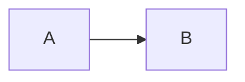

# Docs Toolchain

This site is built with a deliberately layered toolchain: bun for everything it
can do well, and the specialist tool whenever bun's own builtin would overlap.

## The rule

> bun for everything, except where its builtin overlaps a dedicated tool — then
> the dedicated tool wins.

Applied concretely:

| Concern | Tool | Not |
|---|---|---|
| Package management | **bun** (`bun install`) | npm / pnpm / yarn |
| Script running | **bun** (`bun run`) | node |
| Dev server + build | **VitePress** on **Vite 8** | `bun build` |
| Bundling | **Rolldown** (Vite 8's bundler) | `bun build` / esbuild |
| Parse + transform | **oxc** (via Rolldown; plus `oxlint`) | bun's transpiler |
| Testing | **Vitest** | `bun test` |
| Diagrams | **mermaid** | — |

The overlap cases are the interesting ones. bun ships a bundler, a transpiler, a
test runner, and a package manager. Three of those four overlap with a
specialist here, so three are deliberately unused:

- **`bun build` is not used** — VitePress owns the build pipeline, and Vite 8
  bundles with Rolldown. Wiring a second bundler in would mean two module graphs
  and two sets of plugin semantics for one output.
- **`bun test` is not used** — Vitest runs on the same Vite pipeline the site
  builds with, so tests and production share resolution and transform behaviour.
  `bun test` would give a second, divergent module-loading path.
- **bun's transpiler is not used for source** — Rolldown transforms through oxc,
  so transform behaviour matches the bundle that ships.

`bun install` and `bun run` are used everywhere, because nothing else in the
stack competes with them.

## Versions

| Package | Version | Role |
|---|---|---|
| `vitepress` | 2.0.0-alpha.20 | Site framework |
| `vite` | 8.3.0 | Dev server + build (dependency of VitePress) |
| `rolldown` | 1.2.9 | Bundler (dependency of Vite) |
| `@rolldown/binding-linux-x64-gnu` | — | Rolldown's native binding |
| `@oxc-project/types` | — | oxc types, via Rolldown |
| `oxlint` | 1.83.0 | Linter |
| `vitest` | 5.0.1 | Test runner |
| `mermaid` | 12.0.0 | Diagram rendering |
| `vue` | 3.5.43 | VitePress peer |

::: tip Rolldown arrives through Vite, not through an override
Vite 8 depends on `rolldown` directly — check it yourself:

```bash
node -p "Object.keys(require('./node_modules/vite/package.json').dependencies)"
# [ 'lightningcss', 'picomatch', 'postcss', 'rolldown', 'tinyglobby' ]
```

The older `rolldown-vite` package (pinned at 7.3.1, tracking Vite 7) is the
superseded opt-in path. With Vite 8 there is nothing to override: Rolldown *is*
the bundler, and oxc is what Rolldown parses and transforms with. That is why the
lockfile has no `overrides` block.
:::

## Scripts

```bash
bun run dev         # VitePress dev server with HMR
bun run build       # production build -> .vitepress/dist
bun run preview     # serve the built output
bun run test        # vitest run
bun run test:watch  # vitest in watch mode
bun run test:render # browser check: diagrams are drawn, zoom controls work
bun run lint        # oxlint --deny-warnings
bun run lint:fix    # oxlint --fix
bun run check       # lint, then test, then build
```

`bun run check` is the gate for the site itself. `bun run test:render` is separate
because it needs a running server and a browser:

```bash
bun run dev &                     # or: bun run preview
bun run test:render               # checks http://localhost:5173
DOCS_URL=http://localhost:4173 bun run test:render   # against preview
```

On Linux and Windows, Bun drives an installed Chrome/Chromium. If it is not on
`PATH`, point at it explicitly:

```bash
BUN_CHROME_PATH=/path/to/chromium bun run test:render
```

## Layout

```text
docs/
├── .vitepress/
│   ├── config.mts          # site config: nav, sidebar, markdown pipeline
│   ├── plugins/
│   │   └── mermaid.ts      # markdown-it plugin: fences -> <pre class="mermaid">
│   └── theme/
│       ├── index.ts        # theme extension; renders diagrams on the client
│       ├── palette.ts      # gruvbox material dark hard palette (source of truth)
│       ├── shiki.ts        # code-block theme built from that palette
│       ├── mermaid.ts      # diagram themeVariables built from that palette
│       ├── diagram-zoom.ts # fullscreen viewer for diagrams too big for the column
│       └── custom.css      # VitePress variables, pinned to that palette
├── scripts/
│   └── check-render.mjs    # browser check: diagrams are drawn and zoom controls work
├── tests/                  # vitest: docs invariants, diagram validity, source drift
├── index.md                # landing page
├── introduction/           # what the protocol is, who acts, what exists
├── protocol/               # architecture, accounts, instructions, invariants, economics
├── workflows/              # lifecycle, LP capital, settlement
├── security/               # threat model, known limitations
├── reference/              # seeds, instruction/account tables, errors, events
├── development/            # local setup, testing, this page
└── appendix/               # LOI-vs-code divergences
```

## How diagrams work

Diagrams are authored as fenced code blocks and rendered by a two-part pipeline
that this site owns rather than a plugin dependency:

**1. Markdown-it plugin** (`.vitepress/plugins/mermaid.ts`) rewrites

````text

````

into `<pre class="mermaid">` with the definition as escaped text. Braces are
entity-encoded, because VitePress compiles markdown into a Vue template and a
literal double-brace expression inside a diagram would be consumed by Vue's
mustache interpolation before mermaid ever saw it.

**2. Theme enhancement** (`.vitepress/theme/index.ts`) finds those blocks on the
client and calls `mermaid.run()`, stashing the original source in a data
attribute so diagrams can be re-rendered after client-side navigation.

Two details in that code are load-bearing, and both were found by looking at a
rendered page rather than by a unit test:

- **Rendering is driven by a `MutationObserver`, not by `onMounted`.** VitePress
  mounts page content *after* theme setup runs and replaces it again on every
  client-side navigation, so a mount-time render sees an empty element.
- **Completion is detected by an `<svg>` child, not by mermaid's
  `data-processed` attribute.** Mermaid sets that attribute *before* it renders,
  so an early failure leaves the flag behind on a block that never rendered,
  and any code trusting it will strand the block as raw text forever.

The benefits over a prebuilt plugin: the raw definition stays in the HTML (so it
is readable without JavaScript, and greppable), nothing runs during SSR, and
there is no dependency tracking an older VitePress major.

To change the fence language, edit the plugin's `language` option and the
default in `config.mts`.

### Diagrams too big for the column get a fullscreen viewer

Mermaid lays a diagram out at its natural size and `pre.mermaid svg {
max-width: 100% }` then squeezes it into the content column. The end-to-end
sequence diagram is 1727 px wide and lands at 40%, which is where its labels
stop being readable — but the diagram is still *all* there, and that part
matters. An earlier version of this wrapped oversized diagrams in a
fixed-height box with the pan and zoom inline, which traded "small but
complete" for "readable but half-hidden": the reader could no longer see the
whole diagram without dragging inside a 520 px window. That is not what docs
sites do, and it was wrong.

So the page rendering is left alone, and a diagram becomes clickable when
mermaid drew it wider than the column or taller than 900 px — decided per
diagram from the drawn `viewBox` rather than from a list of exceptions. On the
current pages 9 of the 13 qualify. The gantt and the two state diagrams already
fit and are not made clickable, because a viewer could not show them any larger
than the page does. On a narrow screen the column shrinks, so more diagrams
qualify — which is the point, since a phone column cannot hold any of them.

The viewer is a native `<dialog>`, which brings the modal behaviour with it:

- **It fills the viewport**, and it is written to do so explicitly. A modal
  dialog is centred only by the user-agent's `margin: auto`, and this page's CSS
  reset removes it — a fixed box with a definite size and no auto margin is not
  centred, it sits in the top-left corner. Filling the viewport sidesteps
  centring altogether and gives the drawing the whole screen.
- **It opens fitted to the whole diagram**, so nothing is hidden the moment it
  appears. `Fit` returns to that state, and zooming out floors there.
- **Drag to pan**, with pointer capture so a drag that leaves the viewer keeps
  working, and `−` / `Fit` / `+` with a percentage readout where 100% is
  natural size.
- **Keyboard**: `+`, `-`, `0` and the arrow keys on a focusable stage. The
  diagram itself is reachable by `Tab` and opens with Enter or Space.
- **The wheel zooms unconditionally here**, unlike on the page: there is no page
  scroll to protect inside a modal. Ctrl is still left to the browser, which is
  how a trackpad pinch arrives.
- **Escape and the ✕ close it**, and focus returns to the diagram on the page.

Two implementation details are load-bearing. The svg is *moved* into the dialog
rather than cloned, because mermaid scopes its stylesheet to the svg's own `id`
— a clone would duplicate that id and need every selector rewritten. And closing
restores the svg's original `style` attribute, which is what keeps the inline
diagram sized to the column instead of staying at the natural size the viewer
set.

## Diagram layout and build output

Two decisions here are deliberate and easy to undo by accident.

### Flowcharts use `dagre`, not mermaid's default

Mermaid 12 defaults the `flowchart` layout to **ELK**, which is a separate
chunk of roughly 1.4 MB fetched lazily the first time a flowchart renders. The
theme pins the lighter engine instead:

```ts
mermaid.initialize({
  // ...
  flowchart: { layout: 'dagre' },
})
```

Dagre is part of the core mermaid bundle, which is loaded for any diagram, so
pinning it removes the extra fetch entirely. Measured on the built site in a
real browser:

| Page | JS with ELK (default) | JS with dagre |
|---|---|---|
| `/` (no diagrams) | 300 kB | 300 kB |
| `/protocol/architecture` (1 flowchart) | 2563 kB | 1182 kB |
| `/workflows/policy-settlement` (3 sequence diagrams) | 1162 kB | 1162 kB |

Removing that fetch also changed how diagrams are authored: the architecture
page's component map is written as `flowchart TD` because dagre lays out a
left-to-right version of it with overlapping edge labels. If the layout is ever
switched back, re-check that diagram visually.

### The chunk-size limit is raised on purpose

```ts
vite: { build: { chunkSizeWarningLimit: 1500 } }
```

ELK is no longer fetched by any page, but it is still *emitted*: it remains in
mermaid's module graph, and no amount of chunk grouping splits a single 1.4 MB
module below Vite's 500 kB default. Raising the limit silences a warning about a
chunk no page can reach, while still catching real regressions — page payloads
are 300 kB and 1.2 MB, well under the threshold.

If a future mermaid release changes ELK's size or stops emitting it, revisit
both settings rather than only the number.

## Adding a page

1. Create `docs/<section>/<page>.md` with a `# Title` heading.
2. Add it to the matching `sidebar` group in `.vitepress/config.mts`.
3. Run `bun run test` — the sidebar test fails if a page exists without a sidebar
   entry (orphan) or a sidebar entry points at a missing file (dead link).
4. Run `bun run check`.

## What the tests guard

The Vitest suite targets the failure modes a docs site actually has — stale
content, broken diagrams, unreachable pages — rather than rendering details:

- **Sidebar integrity** — every sidebar link resolves to a file, every built page
  is reachable from the nav or sidebar, and `srcExclude` is respected so a
  deliberate exclusion is not mistaken for a dead link.
- **Diagram validity** — every `mermaid` fence parses, catching syntax errors at
  test time instead of in the browser.
- **Markdown pipeline** — the fence plugin emits the right markup, escapes HTML,
  and entity-encodes braces. Braces matter: VitePress compiles markdown into a
  Vue template, so a bare `{ }` reaching the compiler fails the build.
- **Source drift** — documented facts (instruction names, account layouts and
  space allocations, error variants and codes, seed literals, event fields,
  stated counts) are compared against the Rust source in
  `trana/programs/trana/src`. If the program changes and the docs do not, this
  fails.
- **Theme** — `tests/theme.test.ts` holds `custom.css` to `theme/palette.ts`
  (the two repeat the same literals, and CSS cannot import TypeScript) and
  checks the palette's contrast ratios against WCAG minimums: body text at AAA,
  muted text at AA, accents and the brand button at their minimums.
- **Diagram viewer** — `tests/diagram-zoom.test.ts` covers the arithmetic behind
  the fullscreen viewer: when a diagram counts as too wide or too tall for its
  column, and the scale it opens at. That the scale is "the whole diagram fits"
  is asserted as a property rather than as a number, since a viewer that cropped
  the diagram would defeat its own purpose. Whether a *particular* page diagram
  qualifies depends on the size mermaid draws it at, which only a browser knows,
  so `bun run test:render` asserts that end.
- **Component map** — `tests/component-map.test.ts` re-derives, from each
  instruction's `#[derive(Accounts)]` struct, which program-owned accounts it
  mutates or creates, and requires the Component map on `/protocol/architecture`
  to have exactly those edges and no others. The map is the one place whose
  claims are structural rather than textual, so neither the diagram parser nor
  the prose checks cover it — an edge pointing at the wrong account, or missing,
  is invisible to both.

And one check that cannot be a unit test, because the failure it catches is
invisible to both parsing and markup assertions:

- **`bun run test:render`** loads every page in a real browser and asserts each
  `pre.mermaid` block was *drawn*: an `<svg>` with a `viewBox` and content
  inside, and no taller than the block containing it — a diagram with a hidden
  half is the failure that matters to a reader, and no unit test can see it. It
  then drives the viewer on the first diagram that has one: opens fitted to the
  whole diagram, `+` enlarges it, and closing returns the diagram to the page
  with its inline sizing and its focus. The drawn check is not pedantry: mermaid
  appends the `<svg>` element and fills it in a moment later, one diagram at a
  time, so an svg-presence check passes on a blank diagram. A diagram can be
  syntactically valid, correctly transformed in the server output, and still sit
  on the page as raw text or an empty frame — that is a client-side rendering
  bug, and only a browser sees it.

That last one is the reason this directory has tests at all: the documentation
describes a program that will keep changing, and the divergence — or a silently
broken diagram — is what needs catching.

## Related

- [Testing](/development/testing) — the program's own suite
- [Local Setup](/development/local-setup) — building the Rust program
