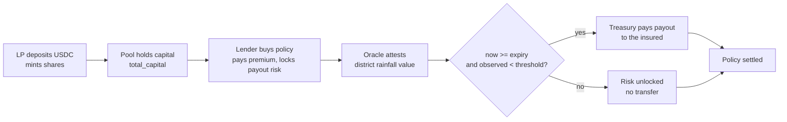

# Overview

Trana is a parametric drought reinsurance protocol on Solana. Rural lenders
(MFIs and FPOs) buy USDC-settled hedges against district-level rainfall
shortfall; liquidity providers underwrite that risk for premium yield; a single
oracle authority attests observations; and settlement is permissionless.

The mechanism is deliberately small: **six instructions, four account types, and
one invariant.**

## The problem it targets

A microfinance institution with a concentrated rural loan book is short a
specific risk: a regional monsoon failure that drives borrower defaults across
its whole portfolio at once. Government crop insurance reimburses farmers
slowly and after contested manual loss assessment, which is the wrong shape for
an institution that needs liquidity while its borrowers are still defaulting.

Trana moves that risk to a balance sheet that wants it. Lenders buy a payout
that triggers on a measured rainfall value, not on an assessed loss, so there is
no adjuster, no claim file, and no dispute window — the oracle's number either
crosses the threshold or it does not.

## Mechanism in one pass



Four properties fall out of that flow, and the rest of this documentation is
about how they are enforced rather than merely intended:

**Premiums are paid up front and in full.** `buy_policy` transfers the premium
before any state is written, so an underfunded buyer cannot end up holding a
live policy.

**The payout is collateralised before the policy exists.** `buy_policy` refuses
to lock a payout larger than the pool's unencumbered capital, so `buy_policy`
cannot create a liability the pool cannot honour.

**Settlement reads one number.** The trigger is
`observed_value < threshold`, evaluated at settlement time against an
oracle-attested account. No discretion is exercised by the crank.

**The crank is untrusted.** Anyone can call `settle_policy`, and the outcome is
fully determined by on-chain state. The crank supplies compute, not judgement.

## What a policy is

A `Policy` is a fixed contract between the pool and one insured account:

| Term | Field | Meaning |
|---|---|---|
| District | `target_id` | Which weather feed the policy tracks |
| Window | `period_id` | Which reporting period (for example a season) |
| Trigger | `threshold` | Payout fires when the observation is **below** this |
| Payout | `payout_amount` | USDC paid on trigger, locked as risk at purchase |
| Cost | `premium_amount` | USDC paid up front, of which a fee is taken |
| Expiry | `expiry_ts` | Earliest timestamp at which settlement is allowed |

`observed_value < threshold` is the entire trigger condition. A policy written
with `threshold = 0` can never pay out, and the program accepts it: validating
that a threshold is actuarially sensible is out of scope.

## Where the money lives

All pool USDC sits in a single token account — the treasury — whose authority is
the `PoolConfig` PDA. The program cannot move it except through
`transfer_from_treasury`, which produces the PDA's seeds during a CPI. There is
no admin key that can drain the treasury.

A useful identity to hold onto, since the accounting is split across two fields:

```text
treasury token balance = total_capital + total_fees
```

`total_capital` backs LP shares and policy payouts; `total_fees` accumulates
protocol fees, which are excluded from LP claims and — as of this program — have
no withdrawal path. See [Economics](/protocol/economics).

## Read next

- [Actors & Roles](/introduction/actors) — who calls what, and what each can do
- [Scope & Status](/introduction/scope) — what exists in this repository, and what does not
- [Architecture](/protocol/architecture) — account graph and PDA derivation
