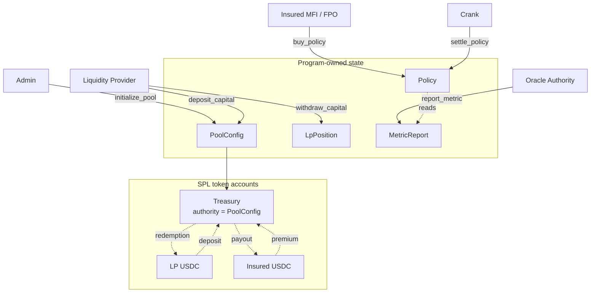

# Architecture

Trana is a single Anchor program. Every piece of state is a program-derived
address (PDA), every value transfer is an SPL Token CPI, and the only account
the program ever signs for is the pool treasury.

## Component map



## PDA derivation

| Account | Seeds | Owner | Signer authority |
|---|---|---|---|
| `PoolConfig` | `[b"config", usdc_mint]` | Trana program | — |
| treasury | `[b"treasury", config]` | SPL Token program | `PoolConfig` PDA |
| `LpPosition` | `[b"lp_position", config, lp]` | Trana program | — |
| `Policy` | `[b"policy", config, policy_id_le]` | Trana program | — |
| `MetricReport` | `[b"metric", target_id_le, period_id_le]` | Trana program | — |

Three consequences follow from these shapes, and each is load-bearing:

**The pool is namespaced by mint.** `PoolConfig` derives from the USDC mint, so
one mint gets one pool, and nothing in the program has to check for a duplicate
pool — the `init` constraint on `[b"config", usdc_mint]` makes a second
initialisation of the same mint fail at the runtime level.

**The treasury is a token account owned by a PDA.** It is not a program-owned
data account but an SPL `TokenAccount` whose authority is the `PoolConfig` PDA.
The program holds no private key; it can only move those funds by producing the
`[b"config", usdc_mint, bump]` seeds during a CPI, which is exactly what
`transfer_from_treasury` does. This is why an arbitrary caller cannot drain the
pool even if a handler forgot a signer check — the token program itself rejects
the transfer.

**`MetricReport` is deliberately not namespaced by pool.** A report is keyed by
`(target_id, period_id)` alone, so a district's observation is a single global
fact shared by every pool that reads it. That is a design choice with a real
consequence: reports cannot be created twice, and one authority's observation
serves all pools. See [Known Limitations](/security/known-limitations).

## The single outbound CPI

`instructions/shared.rs` holds the only function in the program that signs with
program-derived seeds:

```rust
pub fn transfer_from_treasury<'info>(
    token_program: &Program<'info, Token>,
    treasury: &Account<'info, TokenAccount>,
    recipient: &Account<'info, TokenAccount>,
    config: &Account<'info, PoolConfig>,
    amount: u64,
) -> Result<()> {
    let seeds: &[&[u8]] = &[CONFIG_SEED, config.usdc_mint.as_ref(), &[config.bump]];
    let signer_seeds: &[&[&[u8]]] = &[seeds];

    transfer(
        CpiContext::new_with_signer(
            token_program.key(),
            Transfer {
                from: treasury.to_account_info(),
                to: recipient.to_account_info(),
                authority: config.to_account_info(),
            },
            signer_seeds,
        ),
        amount,
    )
}
```

Exactly two instructions call it: `settle_policy` (payout to the insured) and
`withdraw_capital` (redemption to the LP). Both destinations are constrained at
the account level — the payout account is an ATA owned by `policy.insured`, and
the redemption account is an ATA owned by the `lp` signer. Neither destination
is caller-supplied arbitrary.

## Module layout

```text
programs/trana/src/
├── lib.rs              # declare_id!, #[program] mod trana — forwarding only
├── constants.rs        # 5 seed literals + FEE_DENOMINATOR
├── error.rs            # TranaError — 11 flat variants
├── events.rs           # one event per instruction
├── instructions.rs     # pub mod + pub use registry
├── state.rs            # PoolConfig, LpPosition, Policy, MetricReport
└── instructions/
    ├── initialize_pool.rs
    ├── deposit_capital.rs
    ├── buy_policy.rs
    ├── report_metric.rs
    ├── settle_policy.rs
    ├── withdraw_capital.rs
    └── shared.rs       # transfer_from_treasury
```

`lib.rs` contains no logic. Each `#[program]` function forwards its arguments
and `ctx.bumps` into the handler defined in the instruction's own module, which
is where the guards, arithmetic, and event emission live. A new instruction must
be registered in both `lib.rs` and `instructions.rs`.

## Next

- [Accounts & State](/protocol/accounts) — field-by-field layout and space math
- [Instructions](/protocol/instructions) — every handler's guards and effects
- [Invariants](/protocol/invariants) — what the program guarantees, and how
