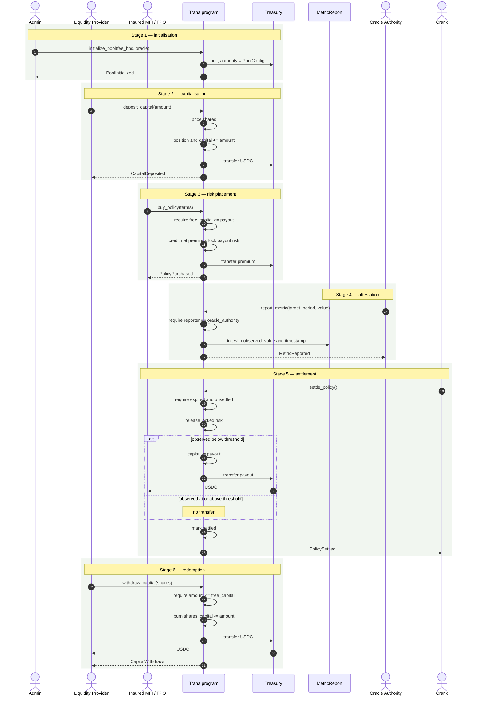
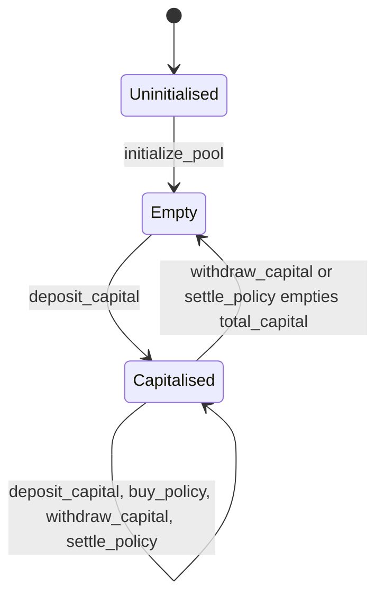
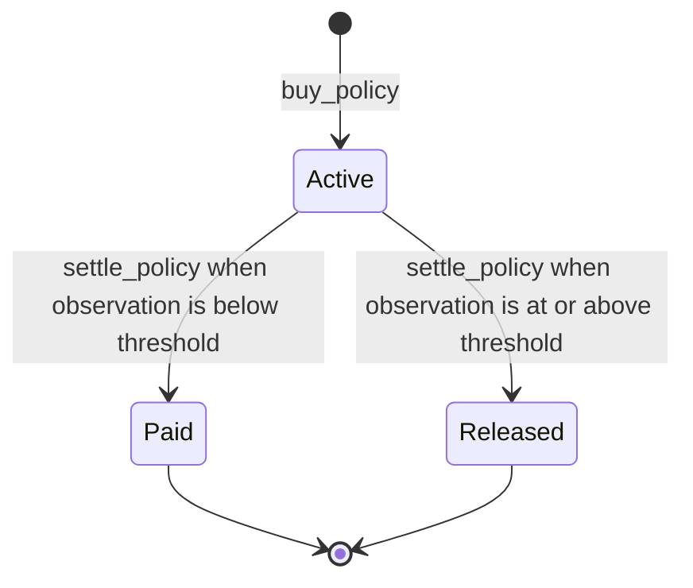
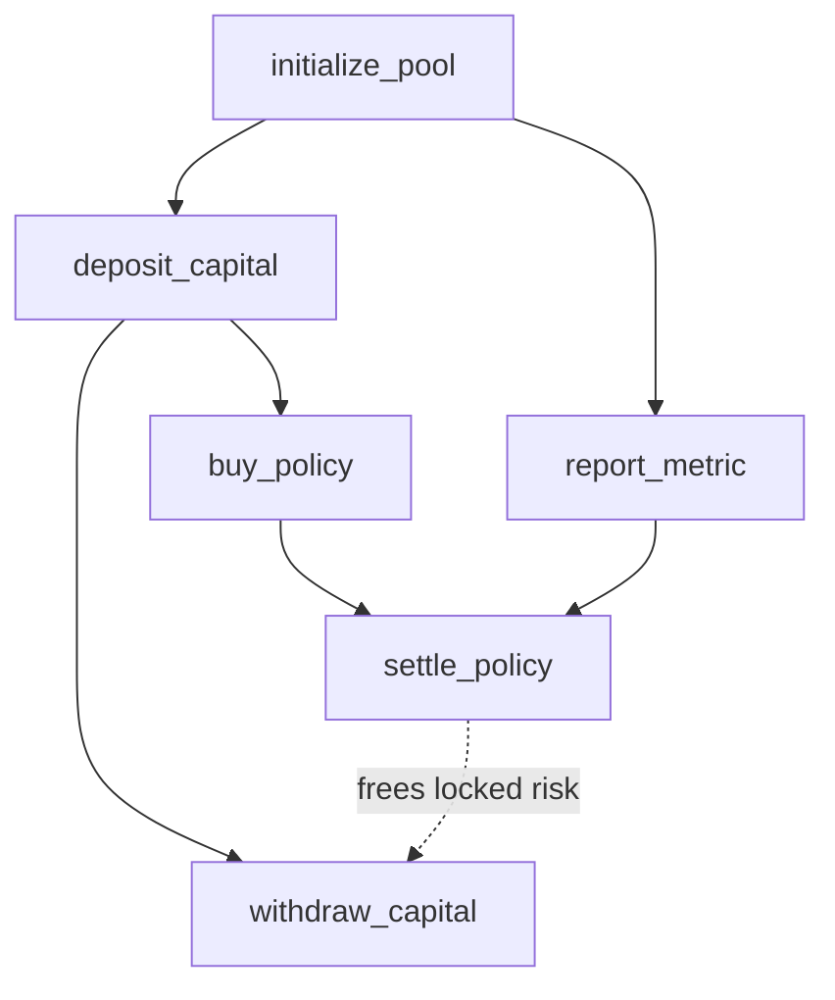

# Pool Lifecycle

The whole protocol, from initialisation to settlement, in the order it happens.

## End-to-end sequence

Stages 2 and 3 can interleave freely: policies can be sold the moment the pool
holds capital, and more capital can arrive while policies are live. Stage 4 must
precede stage 5 for a given `(target_id, period_id)` — `settle_policy` requires
the `MetricReport` account to exist, and there is no fallback if it does not.

## Timeline

```mermaid
gantt
    title Policy lifecycle relative to expiry
    dateFormat X
    axisFormat %s
    section Placement
    Pool capitalised          :done, s1, 0, 90
    Policy purchased          :done, s2, 90, 20
    section Risk period
    Payout locked in total_locked_risk :active, s3, 110, 880
    section Settlement
    Expiry passes             :milestone, m1, 990, 0
    Oracle attests observation :s4, 990, 60
    Crank settles             :s5, 1050, 20
    section After settlement
    Risk released, capital freed :s6, 1070, 300
```

The gap between purchase and expiry is the risk period, during which the payout
is locked and LPs cannot withdraw against it. Settlement is permitted at any
point after expiry — the crank step above is drawn as a short window, but the
program imposes no deadline, and a policy that is never cranked stays locked
indefinitely.

## Pool state machine

`report_metric` is deliberately absent from this diagram: it creates a
`MetricReport` and cannot move pool accounting at all — `config` is not even `mut`
in its account list, so it only reads `oracle_authority` to authorise the caller.

There is no terminal or frozen state. The pool has no pause, no shutdown, and no
migration path; it is a permanent state machine.

## Policy state machine

`Paid` and `Released` are both terminal, distinguished by the `is_paid` flag.
`Active` is terminal in practice for any policy whose district is never attested:
`settle_policy` needs the `MetricReport` account to exist, so the transition never
becomes available. See [Known Limitations](/security/known-limitations).

## Instruction dependency graph

Read the dotted edge as the only coupling between settlement and redemption:
`settle_policy` lowers `total_locked_risk`, which raises `free_capital`, which is
the ceiling on `withdraw_capital`. Until policies settle, LP capital is not fully
withdrawable.

## Next

- [LP Capital](/workflows/lp-capital) — the deposit and redemption paths in detail
- [Policy Settlement](/workflows/policy-settlement) — placement, attestation, settlement
