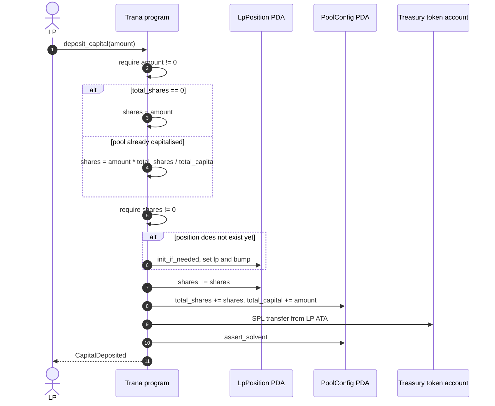
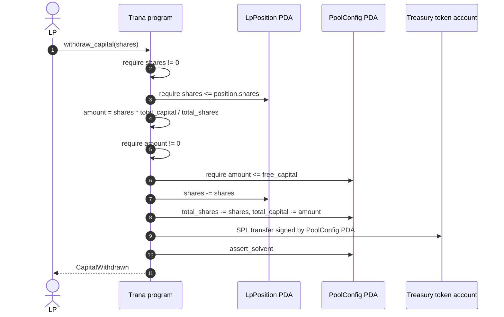
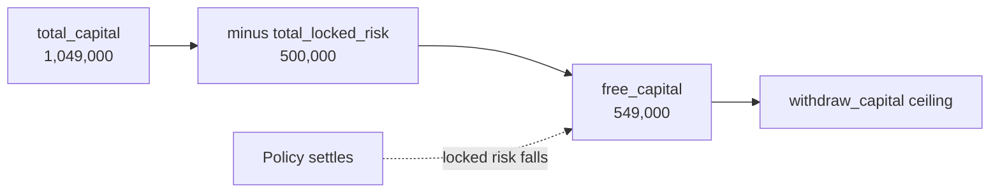

# LP Capital

The LP path: deposit, accrue, redeem. Both ends go through the same
`PoolConfig` PDA authority, and both are bounded by the same free-capital
concept.

## Deposit

The `init_if_needed` account is what makes the first deposit and a repeat deposit
the same instruction. Anchor zero-fills a new account, so the handler detects a
fresh position by `lp_position.lp == Pubkey::default()`.

### Failure modes

| Condition | Result |
|---|---|
| `amount == 0` | `InvalidAmount` |
| `amount` too small to mint a whole share | `InvalidAmount` (from the `shares != 0` guard) |
| LP's ATA missing or wrong mint | Anchor constraint error |
| Treasury authority or mint mismatch | Anchor constraint error |

The second row is the interesting one: because shares floor, a dust deposit into
a pool whose share price exceeds the deposit size would mint zero shares. The
guard converts that from a silent loss into a rejected transaction.

## Redemption

### Failure modes

| Condition | Result |
|---|---|
| `shares == 0` | `InvalidAmount` |
| More shares than the position holds | `InsufficientShares` |
| Position PDA belongs to another LP | `Unauthorized` (account constraint) |
| Redemption exceeds free capital | `InsufficientFreeCapital` |
| Redeeming floors to zero | `InvalidAmount` |

There is no cooldown, no queue, and no partial-withdrawal restriction. An LP can
redeem in one call as long as the pool has unencumbered capital.

## The free-capital ceiling

`free_capital = total_capital - total_locked_risk` is the maximum an LP can take
out. It is the mechanism that stops LPs from stripping capital that is backing
live policies — and it is also why LP liquidity is conditional:

A pool with all its capital locking policy risk is, for withdrawal purposes,
empty — even though the treasury is full. Capital becomes withdrawable only as
policies settle, whether they pay out or not.

That creates the protocol's main LP-side risk: **if a district is never
attested, the policy never settles, its payout stays locked, and the
corresponding capital is unwithdrawable forever.** There is no timeout and no
refund path. LPs should treat an unreported district as a permanent impairment
of that slice of capital, not a delay.

## What determines the redemption value

| Driver | Effect on `total_capital` | Effect on share price |
|---|---|---|
| Deposit | `+ amount` | Dilutive at the margin only |
| Premium collected | `+ net_premium` | Up |
| Triggered settlement | `- payout` | Down |
| Non-triggered settlement | unchanged | unchanged |
| Fee taken | not credited to capital | None |

The last row matters: fees are booked to `total_fees`, which is excluded from
`total_capital`, so LP share pricing is not affected by the fee rate. LPs bear
payouts and receive net premiums; the protocol's cut sits outside their claim.

Full treatment in [Economics](/protocol/economics).

## Related

- [Invariants](/protocol/invariants) — why the ceiling cannot be bypassed
- [Pool Lifecycle](/workflows/lifecycle) — where this fits
- [Known Limitations](/security/known-limitations) — lock-up and stranded-fee consequences
