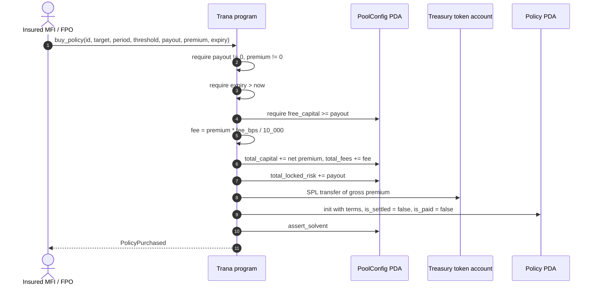
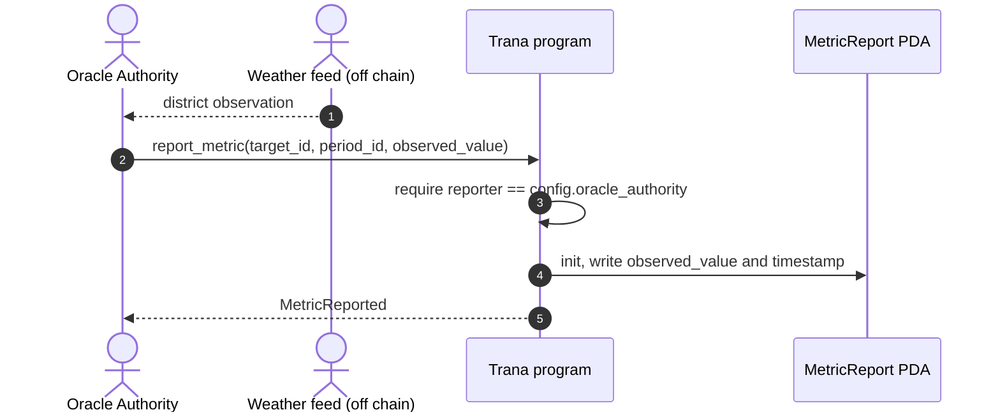
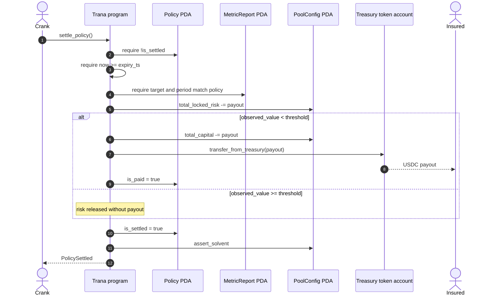

# Policy Settlement

The insured's path: place risk, wait for an attestation, get settled by anyone.

## Placement



The gate is the whole underwriting decision. `free_capital >= payout` is read
before the premium lands, so it is conservative: a policy whose own premium would
cover its payout is still rejected if the pool's existing free capital is short.

### Failure modes

| Condition | Result |
|---|---|
| `payout_amount == 0` | `InvalidAmount` |
| `premium_amount == 0` | `InvalidAmount` |
| `expiry_ts <= now` | `InvalidExpiry` |
| `payout_amount > free_capital` | `Insolvent` |
| `policy_id` already used for this pool | Anchor `init` constraint error |
| Insured ATA missing or wrong mint | Anchor constraint error |

Note the error choice on the fourth row: a payout the pool cannot collateralise
reports `Insolvent`, not `InvalidAmount`. It is a capital-adequacy failure, and
the naming reflects that.

Note also what is *not* checked: `threshold`. A policy with `threshold = 0` is
accepted and can never pay out, because no `u64` observation is below zero.

## Attestation



Outside this repository, the intended consumer of the weather feed is a
TEE-attested oracle. On chain, the only constraint is that the signer equals the
configured authority — the `observed_value` is trusted as given.

Once written, a report cannot be changed. `init` makes `(target_id, period_id)`
write-once, so a bad attestation is permanent and affects every policy pointing
at that pair.

## Settlement



### The trigger

```text
triggered = metric_report.observed_value < policy.threshold
```

Strictly less than. An observation exactly equal to the threshold does **not**
pay. For a drought policy written as "pays below 400mm", 400mm itself is a
non-trigger.

### Failure modes

| Condition | Result |
|---|---|
| Policy already settled | `PolicyAlreadySettled` |
| Called before `expiry_ts` | `PolicyNotExpired` |
| `MetricReport` account does not exist | Anchor account-resolution error |
| Metric target or period mismatch | `MetricMismatch` (unreachable in practice) |
| Triggered but capital below payout | `InsufficientFreeCapital` |

The `MetricMismatch` row is worth explaining: because `metric_report` is derived
from `policy.target_id` and `policy.period_id` in the account seeds, the account
passed in is necessarily the report for that pair, so the field-equality check
can never fail. It is defensive code, not a reachable guard.

The missing-report row is the serious one. There is no timeout, no
default-to-no-payout rule, and no way to settle without the account. A policy
whose district was never attested stays `Active` forever.

### Both branches release risk

Settlement always removes `payout_amount` from `total_locked_risk`. On a
non-trigger the capital stays put and becomes free again, which is what restores
LP withdrawal capacity after a season ends without a drought.

### Consequences of triggering

| Effect | Before | After |
|---|---|---|
| `total_locked_risk` | includes `payout` | `payout` removed |
| `total_capital` | includes `payout` | `payout` removed |
| Treasury balance | `total_capital + total_fees` | reduced by `payout` |
| Insured ATA | — | `+ payout` |
| `is_paid` | `false` | `true` |

The pool's share price falls by `payout / total_shares` in the same transaction.
That is the loss transfer working as designed.

## Related

- [Pool Lifecycle](/workflows/lifecycle) — the full picture
- [Economics](/protocol/economics) — what a payout does to LP share value
- [Known Limitations](/security/known-limitations) — unattested districts and crank liveness
